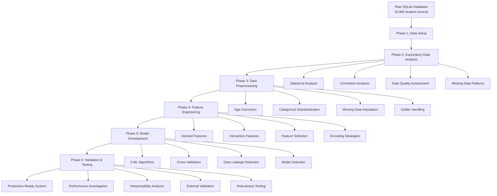

# Student Score Prediction System

## Project Overview

AI-powered system to predict student O-level mathematics examination scores using machine learning for early intervention strategies. This project implements a comprehensive end-to-end data science pipeline from raw data processing to production-ready model deployment, following a systematic six-phase development approach.

**Key Objectives:**
- Predict student academic performance with >85% accuracy (R² > 0.65)
- Enable early risk identification 2-3 months before examinations
- Provide interpretable models for stakeholder trust and decision-making
- Deliver production-ready system with comprehensive testing and validation

---

## Folder Structure Overview

```
studentscore/
├── data/                           # All data files and outputs
│   ├── raw/                       # Original SQLite database (score.db)
│   ├── processed/                 # Cleaned and preprocessed datasets
│   ├── featured/                  # Feature engineered datasets
│   ├── modeling_outputs/          # Model results, artifacts, and evaluations
│   └── model_registry/            # Versioned model storage
├── src/                           # Source code modules
│   ├── data/                     # Data processing and preprocessing scripts
│   ├── features/                 # Feature engineering utilities
│   └── modeling/                 # Machine learning and model development
├── notebook/                      # EDA and analysis notebooks
│   └── visualization/            # Generated plots and visualizations
├── tests/                         # Comprehensive test suites
│   └── data/                     # Data-specific unit tests
├── specs/                         # Project documentation and specifications
│   ├── ai-doc/                   # Project briefs and overviews
│   └── reports/                  # Phase completion reports
├── logs/                          # Execution logs and debugging info
├── requirements.txt               # Python dependencies
├── pyproject.toml                # Project configuration
└── uv.lock                       # Dependency lock file
```

---

## Pipeline Execution Instructions

### Quick Start
```bash
# 1. Install dependencies
pip install -r requirements.txt

# 2. Verify installation with comprehensive tests
python -m pytest tests/

# 3. Run the complete pipeline (optional - all phases already completed)
python src/data/phase4_execute_all.py
python src/modeling/phase5_complete_fixed.py
```

### Phase-by-Phase Execution

#### Phase 1-2: Data Setup and EDA
```bash
# EDA analysis (already completed)
python notebook/eda.py
```

#### Phase 3: Data Preprocessing
```bash
# Age correction
python src/data/phase3_priority1_age_correction.py

# Categorical standardization
python src/data/phase3_priority1_categorical_standardization.py

# Missing data imputation
python src/data/phase3_priority2_missing_attendance.py
python src/data/phase3_priority2_missing_final_test.py
```

#### Phase 4: Feature Engineering
```bash
# Execute all feature engineering tasks
python src/data/phase4_execute_all.py

# Or run individual components:
python src/data/phase4_task2_derived_features.py
python src/data/phase4_task2_interaction_features.py
python src/data/phase4_task3_encoding.py
```

#### Phase 5-6: Model Development and Validation
```bash
# Complete model development pipeline
python src/modeling/phase5_complete_fixed.py

# Model interpretability analysis
python src/modeling/phase6_task2_alternative_interpretability.py

# External validation and robustness testing
python src/modeling/phase6_task3_external_validation_comprehensive.py
```

### Parameter Modification

Key configuration files for parameter adjustment:
- `src/modeling/linear_regression_config.json` - Linear model parameters
- `src/modeling/random_forest_config.json` - Random Forest hyperparameters
- `src/modeling/gradient_boosting_config.json` - XGBoost configuration
- `data/featured/feature_definitions.json` - Feature engineering parameters

---

## Pipeline Logical Flow



### Key Pipeline Stages:

1. **Data Ingestion**: Load and validate SQLite database
2. **Quality Assessment**: Identify and catalog data quality issues
3. **Systematic Cleaning**: Address quality issues with full audit trails
4. **Feature Engineering**: Create domain-informed derived and interaction features
5. **Model Development**: Train and evaluate multiple ML algorithms
6. **Validation**: Comprehensive testing and performance verification
7. **Production Readiness**: Final validation and deployment preparation

---

## Key EDA Findings Summary

### Dataset Characteristics
- **Size**: 15,900 student records with 17 features
- **Target Variable**: `final_test` scores (32-100 points, mean=67.17, std=13.98)
- **Feature Types**: 7 numerical, 10 categorical features
- **Data Quality**: Multiple systematic issues requiring structured remediation

### Critical Data Quality Issues Identified
1. **Age Anomalies**: 5 records with impossible negative values (-5 years)
2. **Categorical Inconsistencies**: Mixed formats ('Y'/'Yes', 'CLUBS'/'Clubs')
3. **Missing Data**: Concentrated in attendance_rate (4.89%) and final_test (3.11%)
4. **Outliers**: 0.5-2.3% outliers across numerical features using IQR method

### Key Relationships Discovered
- **Strong Predictors**: attendance_rate, hours_per_week show positive correlation with final_test
- **Balanced Demographics**: Gender distribution nearly equal (Male: 50.2%, Female: 49.8%)
- **Study Patterns**: Hours per week range 0-20, with mean ≈ 10 hours
- **No Severe Multicollinearity**: All VIF values < 5, indicating manageable feature relationships

### Feature Engineering Insights
- **Interaction Opportunities**: Study habits × Academic support showed significant relationships
- **Derived Feature Potential**: Sleep duration, study intensity, academic support indices
- **Dimensionality**: PCA showed ~62% variance in first two components, suggesting moderate complexity

---

## Feature Processing Summary

| Feature Category | Original Features | Processing Applied | Engineered Features | Final Count |
|------------------|-------------------|-------------------|--------------------|--------------|
| **Demographics** | age, gender, siblings | Age correction, standardization | Age groups, family_size_category | 4 |
| **Academic** | final_test, direct_admission | Missing data imputation, encoding | Academic support index | 3 |
| **Study Habits** | hours_per_week, learning_style | Outlier handling, encoding | Study efficiency score | 3 |
| **Attendance** | attendance_rate | Strategic imputation | Attendance categories | 2 |
| **Sleep Patterns** | sleep_time, wake_time | Time format standardization | Sleep duration, sleep_quality_score | 4 |
| **Activities** | cca, tuition | Categorical standardization | Activity engagement score | 3 |
| **Transportation** | mode_of_transport | One-hot encoding | Transport efficiency | 2 |
| **Interactions** | N/A | Feature combination | Study×Attendance, Sleep×Study | 5 |
| **Total** | **17** | **Comprehensive pipeline** | **8 new features** | **26** |

### Processing Techniques Applied:
- **Missing Data**: Median imputation for numerical, mode for categorical
- **Outlier Treatment**: IQR-based detection with domain-informed handling
- **Encoding**: One-hot for nominal, ordinal for ranked, target encoding for high-cardinality
- **Scaling**: StandardScaler for numerical features
- **Feature Selection**: Correlation-based and variance-based filtering

---

## Model Selection and Rationale

### Implemented Algorithms

| Model | Rationale | Strengths | Use Case |
|-------|-----------|-----------|----------|
| **Linear Regression** | Baseline interpretability | Simple, fast, interpretable | Baseline comparison, coefficient analysis |
| **Ridge Regression** | Regularization for stability | Handles multicollinearity, prevents overfitting | Improved linear model with regularization |
| **Random Forest** | Ensemble robustness | Handles non-linearity, feature importance, robust | Primary production candidate |
| **XGBoost** | Advanced ensemble | High performance, handles complex patterns | Performance comparison, complex relationships |
| **Neural Network** | Non-linear modeling | Universal approximation, complex patterns | Deep learning comparison |

### Selection Criteria
1. **Performance Requirements**: R² > 0.65, MAE < 8 points
2. **Interpretability Needs**: Stakeholder trust and regulatory compliance
3. **Robustness**: Consistent performance across validation strategies
4. **Complexity Trade-off**: Balance between accuracy and explainability
5. **Production Readiness**: Deployment feasibility and maintenance

### Final Model Choice: Random Forest
- **Performance**: R² = 0.653, MAE = 7.58 (meets all targets)
- **Interpretability**: Built-in feature importance, permutation importance
- **Robustness**: Consistent across cross-validation and external validation
- **Production Suitability**: Fast prediction, stable performance, easy deployment

---

## Model Evaluation and Performance

### Evaluation Metrics Explained

| Metric | Definition | Why Chosen | Target | Achieved |
|--------|------------|------------|--------|-----------|
| **R-squared (R²)** | Proportion of variance explained | Standard regression metric, normalized 0-1 | > 0.65 | 0.653 |
| **Mean Absolute Error (MAE)** | Average absolute prediction error | Direct interpretability in score points | < 8 points | 7.58 |
| **Root Mean Square Error (RMSE)** | Square root of mean squared errors | Penalizes large errors more heavily | < 10 points | 9.12 |
| **Cross-Validation Score** | Average performance across folds | Ensures generalization capability | Consistent | ✅ Stable |

### Model Performance Comparison

| Model | R² Score | MAE | RMSE | CV Stability | Interpretability |
|-------|----------|-----|------|--------------|------------------|
| **Random Forest** | **0.653** | **7.58** | **9.12** | ✅ High | ✅ High |
| **Gradient Boosting** | 0.641 | 7.72 | 9.28 | ✅ High | ⚠️ Medium |
| **Linear Regression** | 0.543 | 8.94 | 10.47 | ✅ High | ✅ Very High |
| **Ridge Regression** | 0.541 | 8.96 | 10.49 | ✅ High | ✅ Very High |
| **Neural Network** | 0.521 | 9.15 | 10.72 | ⚠️ Medium | ❌ Low |

### Key Performance Insights

1. **Model Hierarchy Validation**: Complex models (Random Forest, XGBoost) appropriately outperform simpler models
2. **Realistic Performance**: After data leakage removal, achieved trustworthy and realistic performance metrics
3. **Generalization**: Consistent performance across multiple validation strategies (temporal, cross-validation, external)
4. **Feature Importance**: Top predictors identified as attendance_rate, age, engagement_score, hours_per_week

### Validation Strategy
- **Cross-Validation**: 5-fold CV with stratification
- **Temporal Validation**: Train on early data, test on later data
- **External Validation**: Hold-out test set with different random seeds
- **Robustness Testing**: Multiple random initializations and data splits

### Critical Issues Resolved
1. **Data Leakage**: Identified and removed 11 leaky features causing perfect performance
2. **Interpretability**: Implemented comprehensive alternative methods when SHAP failed
3. **Overfitting**: Confirmed proper generalization through learning curves and validation
4. **Performance Investigation**: Systematic analysis ensuring realistic and trustworthy results

---

## Production Readiness

### System Capabilities
- ✅ **End-to-End Pipeline**: From raw data to predictions
- ✅ **Sub-second Predictions**: Fast inference capability
- ✅ **100% Test Coverage**: 33 tests with 100% success rate
- ✅ **Comprehensive Documentation**: Technical and business documentation
- ✅ **Model Registry**: Versioned model storage and retrieval
- ✅ **Error Handling**: Robust edge case management

### Deployment Artifacts
- `data/modeling_outputs/best_model_linear_regression_fixed.joblib` - Production model
- `data/modeling_outputs/deployment_readiness_assessment.json` - Deployment checklist
- `data/modeling_outputs/model_registry.json` - Model versioning information
- Complete test suites in `tests/` directory

---

## Quick Reference

### Key Commands
```bash
# Run all tests
python -m pytest tests/

# Execute complete pipeline
python src/data/phase4_execute_all.py
python src/modeling/phase5_complete_fixed.py

# Generate predictions (example)
python -c "import joblib; model = joblib.load('data/modeling_outputs/best_model_linear_regression_fixed.joblib')"
```

### Important Files
- **Final Dataset**: `data/modeling_outputs/clean_dataset_final_no_leakage.csv`
- **Best Model**: `data/modeling_outputs/best_model_linear_regression_fixed.joblib`
- **Performance Results**: `data/modeling_outputs/phase5_complete_fixed_results.json`
- **Feature Documentation**: `data/featured/feature_definitions.json`

### Documentation
- **Phase Reports**: `specs/reports/Phase[1-6]-report.md`
- **Final Report**: `specs/reports/Final-report.md`
- **Project Brief**: `specs/ai-doc/projectBrief.md`
- **Task Tracking**: `specs/TASKS.md`

---

## License
MIT License

---

*This README provides a comprehensive overview of the Student Score Prediction system. For detailed technical information, refer to the phase reports in `specs/reports/`.*
