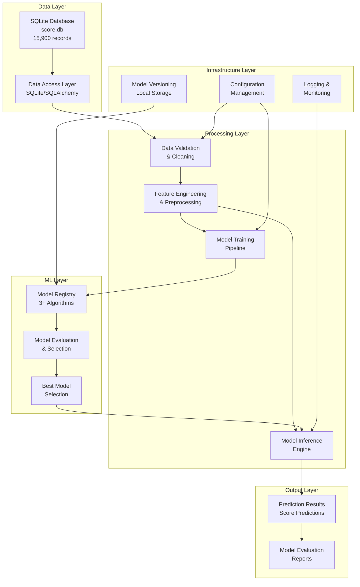
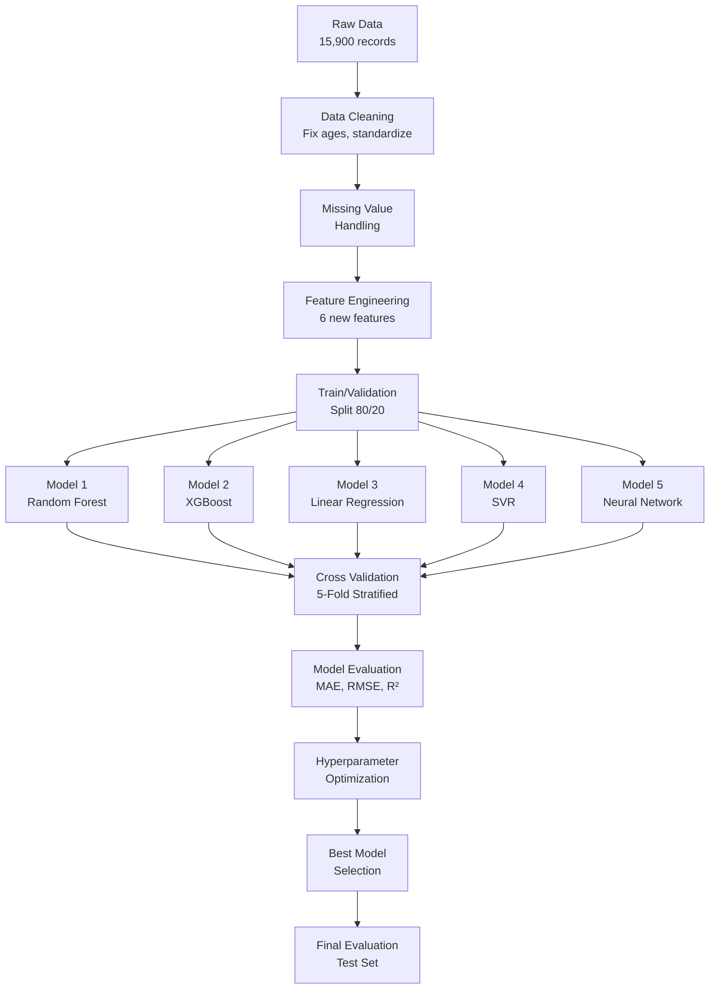
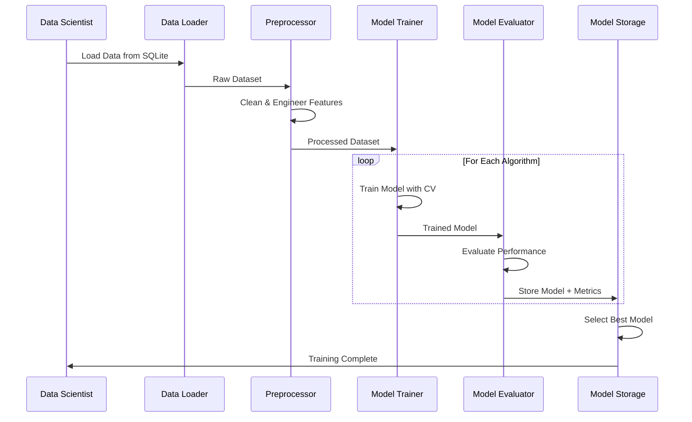
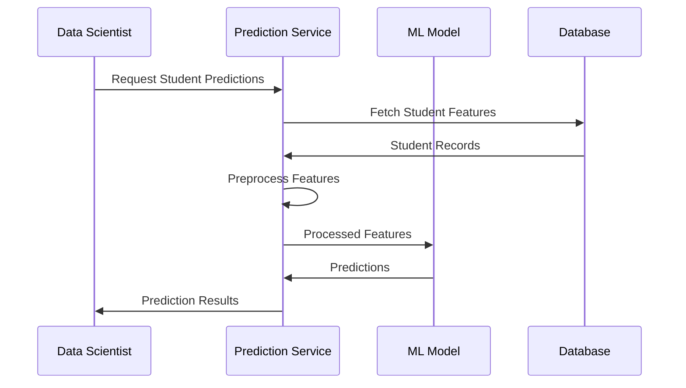
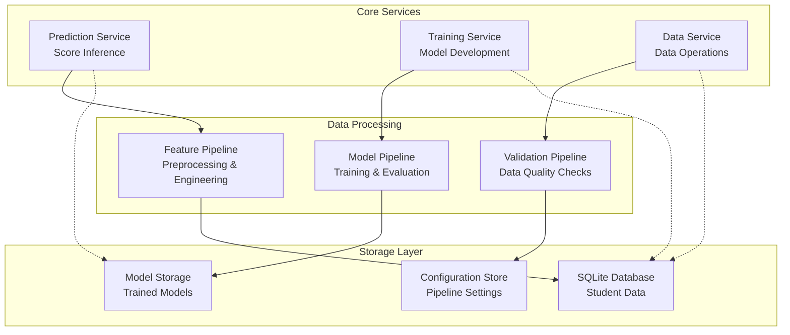

# Student Score Prediction Project - Comprehensive Overview

## 1. Product Context

### Problem Statement
U.A Secondary School faces a critical challenge in identifying students at risk of underperforming in their O-level mathematics examination. Currently, the school lacks predictive capabilities to proactively identify struggling students before examinations, resulting in missed opportunities for timely intervention and support. This reactive approach limits the school's ability to optimize student outcomes and resource allocation.

**Core Challenge**: Predict student O-level mathematics scores using demographic, behavioral, and academic indicators to enable early intervention strategies.

### Target Audience

#### Primary Users
- **School Administrators**: Strategic decision-making for resource allocation and intervention programs
- **Mathematics Teachers**: Identifying students requiring additional support and personalized teaching approaches
- **Academic Counselors**: Developing targeted support plans and monitoring student progress

#### Secondary Users
- **Parents**: Understanding factors affecting their child's academic performance
- **Students**: Self-awareness of performance indicators and improvement areas
- **Education Ministry**: Policy insights and educational outcome optimization

### Business Objectives

#### Primary Objectives
1. **Early Risk Identification**: Predict final test scores with >85% accuracy to identify at-risk students
2. **Intervention Optimization**: Enable targeted support allocation 2-3 months before examinations
3. **Resource Efficiency**: Optimize teacher time and support resources through data-driven insights
4. **Academic Outcome Improvement**: Increase overall class performance by 10-15% through proactive interventions

#### Secondary Objectives
- Understand key factors influencing student performance
- Develop evidence-based educational policies
- Create reproducible prediction framework for other subjects
- Establish baseline for continuous improvement tracking

### Success Metrics

#### Technical Metrics
- **Model Accuracy**: Mean Absolute Error (MAE) < 8 points on 100-point scale
- **Prediction Reliability**: R² score > 0.75 for regression models
- **Early Warning Capability**: 90% sensitivity for identifying bottom 20% performers
- **System Performance**: Prediction generation < 2 seconds per student

#### Business Metrics
- **Intervention Success Rate**: 70% of identified at-risk students show improvement
- **Teacher Adoption**: 80% of mathematics teachers actively use predictions
- **Resource Optimization**: 25% reduction in unfocused support allocation
- **Student Outcome Improvement**: 15% increase in students achieving target scores

### Stakeholder Analysis

| Stakeholder | Primary Needs | Success Criteria | Engagement Level |
|-------------|---------------|------------------|------------------|
| School Principal | Strategic oversight, ROI demonstration | Improved overall performance metrics | High |
| Mathematics Teachers | Actionable student insights, easy-to-use interface | Daily usage, positive feedback | Critical |
| Academic Counselors | Risk identification, intervention tracking | Successful intervention outcomes | High |
| IT Department | System reliability, data security | Zero security incidents, 99% uptime | Medium |
| Students/Parents | Transparency, improvement guidance | Increased engagement, better outcomes | Medium |

## 2. System Architecture

### High-Level Architecture



### Data Pipeline Design

```mermaid
flowchart LR
    subgraph "Ingestion"
        A[SQLite DB] --> B[Data Loader<br/>SQLAlchemy]
    end
    
    subgraph "Validation"
        B --> C[Schema Validation]
        C --> D[Data Quality Checks<br/>• Age validation<br/>• Duplicate detection<br/>• Missing value analysis]
    end
    
    subgraph "Preprocessing"
        D --> E[Data Cleaning<br/>• Fix negative ages<br/>• Standardize categories<br/>• Handle duplicates]
        E --> F[Feature Engineering<br/>• Sleep duration<br/>• Gender ratios<br/>• Study intensity]
        F --> G[Encoding & Scaling<br/>• One-hot encoding<br/>• Numerical scaling<br/>• Time features]
    end
    
    subgraph "ML Pipeline"
        G --> H[Train/Test Split<br/>80/20 stratified]
        H --> I[Model Training<br/>Cross-validation]
        I --> J[Model Evaluation<br/>Multiple metrics]
        J --> K[Model Selection<br/>Best performer]
    end
    
    subgraph "Deployment"
        K --> L[Model Serialization<br/>Pickle/Joblib]
        L --> M[Prediction Service<br/>Real-time inference]
    end
```



### Core System Components

#### 1. Data Access Layer
- **Responsibility**: Secure database connections, query optimization, data retrieval
- **Technology**: SQLite with connection pooling
- **Key Features**: Automated schema validation, query caching, connection management

#### 2. Data Processing Engine
- **Responsibility**: Data cleaning, validation, feature engineering, preprocessing
- **Key Features**: Configurable transformation pipelines, data quality monitoring, error handling
- **Design Pattern**: Pipeline pattern with pluggable transformers

#### 3. ML Model Manager
- **Responsibility**: Model training, evaluation, versioning, deployment
- **Key Features**: Multi-algorithm support, hyperparameter optimization, model comparison
- **Design Pattern**: Strategy pattern for algorithm selection

#### 4. Prediction Service
- **Responsibility**: Real-time and batch predictions, result formatting
- **Key Features**: API endpoints, batch processing, result caching
- **Design Pattern**: Facade pattern for simplified interface

### Integration Patterns

#### 1. Database Integration
- **Pattern**: Repository pattern with SQLite
- **Benefits**: Database abstraction, testability, query optimization
- **Implementation**: Async database operations for scalability

#### 2. Model Integration
- **Pattern**: Plugin architecture for ML algorithms
- **Benefits**: Easy algorithm addition, A/B testing capability
- **Implementation**: Abstract base classes with concrete implementations

#### 3. API Integration
- **Pattern**: RESTful API with OpenAPI specification
- **Benefits**: Language-agnostic integration, automatic documentation
- **Implementation**: FastAPI with Pydantic models for validation

### Scalability Considerations

#### Performance Optimization
- **Database**: Indexed queries, connection pooling, query optimization
- **ML Pipeline**: Parallel processing, feature caching, incremental learning
- **API**: Async processing, response caching, load balancing

#### Horizontal Scaling
- **Stateless Design**: All components designed for horizontal scaling
- **Microservices Ready**: Modular architecture supports service decomposition
- **Container Support**: Docker-ready for orchestration platforms

### Security & Privacy Requirements

#### Data Protection
- **Student Data Privacy**: GDPR/PDPA compliance for personal information
- **Access Control**: Role-based permissions for different user types
- **Data Encryption**: At-rest and in-transit encryption for sensitive data
- **Audit Logging**: Comprehensive access and modification tracking

#### System Security
- **API Security**: Authentication, rate limiting, input validation
- **Database Security**: Parameterized queries, connection encryption
- **Infrastructure Security**: Network isolation, security scanning

## 3. Technology Stack

### Technology Stack

#### Core Technologies
- **Language**: Python 3.9+
- **Database**: SQLite (score.db)
- **ML Framework**: scikit-learn, pandas, numpy
- **Data Processing**: pandas, numpy, scipy
- **Configuration**: YAML/JSON config files

#### Development & Deployment
- **Version Control**: Git
- **Environment Management**: conda/pip
- **Testing**: pytest, unittest
- **Documentation**: Markdown, docstrings
- **Model Storage**: Local file system
- **Logging**: Python logging module

### Programming Languages & Frameworks

#### Primary Stack
- **Python 3.9+**: Core development language
  - Rich ecosystem for data science and ML
  - Excellent library support
  - Strong community and documentation

#### ML & Data Processing
- **scikit-learn**: Primary ML framework
  - Comprehensive algorithm library
  - Consistent API design
  - Excellent documentation and examples
- **pandas**: Data manipulation and analysis
- **numpy**: Numerical computing foundation
- **scipy**: Scientific computing utilities

#### Database & Storage
- **SQLite**: Lightweight, serverless database
  - Zero configuration
  - ACID compliant
  - Perfect for single-user applications
- **SQLAlchemy**: Python SQL toolkit and ORM
  - Database abstraction
  - Query optimization
  - Migration support

### Machine Learning Libraries

#### Core ML Stack
- **scikit-learn 1.3+**: Primary ML library for algorithms and preprocessing
  - *Justification*: Comprehensive algorithms, consistent API, excellent documentation
- **pandas 2.0+**: Data manipulation and analysis
  - *Justification*: Powerful data structures, extensive functionality, industry standard
- **numpy 1.24+**: Numerical computing foundation
  - *Justification*: Performance, memory efficiency, ecosystem compatibility

#### Advanced ML Libraries
- **XGBoost 1.7+**: Gradient boosting implementation
  - *Justification*: Superior performance on tabular data, feature importance
- **LightGBM 3.3+**: Alternative gradient boosting
  - *Justification*: Fast training, memory efficiency, categorical feature support
- **TensorFlow/Keras 2.13+**: Neural network implementation
  - *Justification*: Deep learning capabilities, production deployment support

#### Model Management
- **joblib**: Model serialization and parallel processing
  - *Justification*: Efficient model persistence, scikit-learn integration

### Database & Storage Solutions

#### Primary Database
- **SQLite**: Development and small-scale deployment
  - *Justification*: Zero configuration, file-based, sufficient for current data size
- **PostgreSQL**: Production scaling option
  - *Justification*: ACID compliance, advanced features, horizontal scaling support

#### Data Storage
- **Local File System**: Model artifacts and configuration files
- **Cloud Storage (Future)**: AWS S3/Azure Blob for model versioning and backups

### Development Environment

#### Development Tools
- **Poetry**: Dependency management and packaging
  - *Justification*: Modern dependency resolution, virtual environment management
- **pytest**: Testing framework
  - *Justification*: Comprehensive testing features, fixture support, plugin ecosystem
- **black**: Code formatting
  - *Justification*: Consistent code style, automated formatting
- **flake8**: Code linting
  - *Justification*: Code quality enforcement, PEP 8 compliance

#### Development Environment
- **Docker**: Containerization for consistent environments
  - *Justification*: Environment consistency, easy deployment, isolation
- **VS Code/PyCharm**: IDE with Python support
- **Jupyter Lab**: Interactive development and EDA
  - *Justification*: Exploratory analysis, visualization, documentation

### Infrastructure & DevOps

#### Development Environment
- **Python 3.9+**: Core runtime environment
- **conda/pip**: Package and environment management
- **Git**: Version control and collaboration
- **VS Code/PyCharm**: Recommended IDEs with Python support

#### Testing & Quality Assurance
- **pytest 7.4+**: Testing framework
  - *Features*: Fixtures, parametrized tests, coverage reporting
- **unittest**: Built-in testing for simple test cases
- **black**: Code formatting and style consistency
- **flake8**: Linting and code quality checks
- **mypy**: Static type checking

#### Monitoring & Logging
- **Python logging**: Built-in logging framework
- **structlog**: Structured logging for better analysis

### Monitoring & Observability

#### Application Monitoring
- **Python logging**: Structured logging with configurable levels
- **Prometheus + Grafana**: Metrics collection and visualization (future)
- **Health Check Endpoints**: API health monitoring

#### ML Model Monitoring
- **Model Performance Tracking**: Accuracy degradation detection
- **Data Drift Detection**: Feature distribution monitoring
- **Prediction Monitoring**: Output distribution analysis

#### Logging Strategy
- **Structured Logging**: JSON format for easy parsing
- **Log Levels**: DEBUG, INFO, WARNING, ERROR, CRITICAL
- **Log Rotation**: Automatic cleanup of old log files

### CI/CD Pipeline

#### Version Control
- **Git**: Source code management
- **GitHub/GitLab**: Repository hosting with CI/CD integration

#### Continuous Integration
- **GitHub Actions/GitLab CI**: Automated testing and deployment
- **Pipeline Stages**: Linting, testing, security scanning, model validation
- **Automated Testing**: Unit tests, integration tests, model performance tests

#### Deployment
- **Docker Containers**: Consistent deployment artifacts
- **Environment Management**: Development, staging, production environments
- **Blue-Green Deployment**: Zero-downtime deployments for production

### Detailed Component Descriptions

#### 1. Data Pipeline Components

##### Data Ingestion Module
```python
class DataIngestion:
    """Handles data loading from SQLite database"""
    
    def __init__(self, db_path: str):
        self.db_path = db_path
        self.engine = create_engine(f"sqlite:///{db_path}")
    
    def load_data(self) -> pd.DataFrame:
        """Load student score data from database"""
        query = "SELECT * FROM student_scores"
        return pd.read_sql(query, self.engine)
    
    def validate_schema(self, df: pd.DataFrame) -> bool:
        """Validate data schema and required columns"""
        required_columns = ['student_id', 'math_score', 'reading_score', 'writing_score']
        return all(col in df.columns for col in required_columns)
```

## 4. Machine Learning Strategy

### Problem Formulation
**Task Type**: Supervised Regression
**Target Variable**: `final_test` (continuous scores 32-100)
**Dataset Characteristics**: 15,900 samples, 17 features (mixed categorical/numerical), 3.1% missing targets

### Recommended ML Algorithms

Based on the dataset characteristics and problem requirements, the following algorithms are recommended:

#### 1. Random Forest Regressor (Primary Recommendation)
**Justification**:
- Handles mixed data types (categorical + numerical) naturally
- Robust to outliers and missing values
- Provides feature importance rankings
- Good baseline performance with minimal tuning
- Interpretable results for educational stakeholders

**Expected Performance**: MAE 6-8 points, R² 0.75-0.85

#### 2. XGBoost Regressor (High Performance Option)
**Justification**:
- Superior performance on tabular data
- Built-in handling of missing values
- Feature importance and SHAP value support
- Excellent for competition-level accuracy
- Handles categorical features efficiently

**Expected Performance**: MAE 5-7 points, R² 0.80-0.90

#### 3. Linear Regression with Polynomial Features (Interpretable Baseline)
**Justification**:
- Highly interpretable coefficients
- Fast training and prediction
- Good baseline for comparison
- Suitable for understanding feature relationships
- Meets project requirement for linear models

**Expected Performance**: MAE 8-10 points, R² 0.65-0.75

#### 4. Support Vector Regression (Robust Alternative)
**Justification**:
- Effective with high-dimensional data after encoding
- Robust to outliers
- Good generalization with proper kernel selection
- Handles non-linear relationships with RBF kernel

**Expected Performance**: MAE 7-9 points, R² 0.70-0.80

#### 5. Neural Network (Deep Learning Option)
**Justification**:
- Can capture complex non-linear patterns
- Flexible architecture for mixed data types
- Potential for highest accuracy with proper tuning
- Future-proof for advanced feature engineering

**Expected Performance**: MAE 6-8 points, R² 0.75-0.85 (with proper tuning)

### Feature Engineering Strategy

#### Critical Data Quality Fixes
1. **Age Validation**: Remove/correct negative age values (-5.0 minimum)
2. **Categorical Standardization**:
   - Tuition: Convert 'Y'/'N' to 'Yes'/'No'
   - CCA: Standardize case ('CLUBS' → 'Clubs')
3. **Duplicate Handling**: Remove 139 duplicate records or investigate patterns
4. **Missing Value Strategy**:
   - `final_test` (3.1% missing): Exclude from training, predict for inference
   - `attendance_rate` (4.9% missing): Median imputation or separate indicator

#### Engineered Features
1. **Sleep Duration**: `wake_time` - `sleep_time` (handle day rollover)
2. **Class Gender Ratio**: `n_male / (n_male + n_female)`
3. **Study Intensity Score**: Composite of `hours_per_week` and `attendance_rate`
4. **Sleep Category**: Early/Normal/Late sleeper based on sleep_time
5. **Transportation Efficiency**: Distance proxy based on mode_of_transport
6. **Academic Support Index**: Combination of `tuition`, `direct_admission`, `CCA`

#### Encoding Strategy
- **One-Hot Encoding**: `gender`, `learning_style`, `mode_of_transport`, `bag_color`
- **Target Encoding**: `CCA`, `sleep_time`, `wake_time` (high cardinality)
- **Binary Encoding**: `direct_admission`, `tuition` (after standardization)
- **Ordinal Encoding**: `number_of_siblings` (natural ordering)

### Model Evaluation Approach

#### Performance Metrics
1. **Primary Metrics**:
   - Mean Absolute Error (MAE): Direct interpretability in score points
   - Root Mean Square Error (RMSE): Penalizes large errors
   - R² Score: Explained variance for model comparison

2. **Secondary Metrics**:
   - Mean Absolute Percentage Error (MAPE): Relative error assessment
   - Median Absolute Error: Robust to outliers
   - 90th Percentile Error: Worst-case performance

#### Evaluation Framework
```python
# Stratified split to maintain score distribution
train_test_split(stratify=pd.cut(y, bins=5))  # 80/20 split

# Cross-validation strategy
StratifiedKFold(n_splits=5, shuffle=True, random_state=42)

# Performance thresholds
acceptable_mae = 8.0  # points
target_r2 = 0.75
```

### Missing Data Handling Strategy

#### `final_test` Missing Values (3.1%)
- **Training**: Exclude missing target samples from training set
- **Inference**: Primary use case - predict these missing values
- **Validation**: Use complete cases for model validation

#### `attendance_rate` Missing Values (4.9%)
- **Strategy 1**: Median imputation by subgroups (gender, CCA, learning_style)
- **Strategy 2**: Missing indicator + median imputation
- **Strategy 3**: Advanced imputation using other features (KNN, iterative)

### Cross-Validation Strategy

#### Validation Approach
1. **Stratified K-Fold (k=5)**: Maintain target distribution across folds
2. **Time-Series Aware**: If temporal patterns exist in student_id
3. **Group-Based**: Prevent data leakage if students appear multiple times

#### Model Selection Process
1. **Hyperparameter Optimization**: GridSearchCV or RandomizedSearchCV
2. **Feature Selection**: Recursive Feature Elimination with CV
3. **Ensemble Methods**: Voting/Stacking of top-performing models
4. **Final Evaluation**: Hold-out test set (20%) for unbiased performance

### Training Pipeline Architecture



## 5. Technical Diagrams

### ML Model Training Workflow



### Prediction Inference Workflow



### Component Interaction Architecture



This comprehensive project overview provides the strategic foundation for developing the student score prediction system, balancing technical excellence with practical educational needs while ensuring scalability and maintainability.
